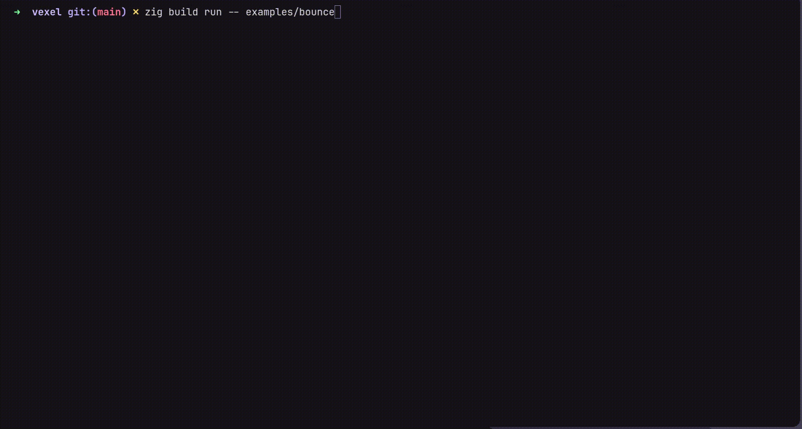

# Vexel

**Terminal graphics runtime — write Lua, not C.**

Pixel-perfect rendering, 8-layer compositing, audio, persistence, and an entity system. All in the terminal. All from Lua.

<!-- Record GIFs with: vhs media/bounce.tape  or  asciinema rec + agg -->
 

```lua
function engine.load()
    engine.graphics.set_resolution(320, 180)
end

function engine.draw()
    engine.graphics.pixel.rect(10, 10, 100, 60, 0xFF3366FF)
    engine.graphics.draw_text(2, 1, "hello from vexel", 0xFFFFFFFF)
end
```

```bash
zig build run -- my-project/    # project dir must contain main.lua
```

## Batteries included

| Module | What it does |
|--------|-------------|
| **Graphics** | 8-layer pixel compositor, primitives, images, spritesheets, tilemaps |
| **Scenes** | Screen stack with push/pop/switch and transitions (fade, slide, wipe) |
| **ECS** | Sparse-set entity system with built-in movement, animation, and rendering |
| **Audio** | WAV/OGG/MP3 playback, volume, panning, fade in/out |
| **Input** | Keyboard, mouse, virtual gamepad |
| **Timers** | One-shot, repeating, tweens with easing |
| **Persistence** | Key-value store + raw SQLite |

## Build

Requires Zig 0.15.2. Terminal must support the Kitty graphics protocol (Kitty, Ghostty).

```bash
zig build                           # compile
zig build run -- examples/bounce/  # run an example
zig build test                      # unit tests
```

## Using Vexel as a Zig library

Register Zig modules callable from Lua — good for hot loops, native APIs, or anything too slow in Lua.

**`build.zig.zon`:**
```zig
.dependencies = .{
    .vexel = .{ .url = "...", .hash = "..." },
},
```

**`build.zig`:**
```zig
const vexel_dep = b.dependency("vexel", .{ .target = target, .optimize = optimize });
exe.root_module.addImport("vexel", vexel_dep.module("vexel"));
```

**`main.zig`:**
```zig
const vexel = @import("vexel");

pub fn main() !void {
    var gpa = std.heap.GeneralPurposeAllocator(.{}){};
    defer _ = gpa.deinit();

    var app = try vexel.App.init(gpa.allocator(), .{ .project_dir = "." });
    defer app.deinit();

    app.registerModule("mymod", my_module);  // callable as mymod.fn() from Lua
    try app.run();
}
```

Module functions are either:
- **Auto-wrapped** (pure Zig types only): `fn myFn(a: f64, b: i32) f64`
- **Engine-aware** (direct renderer/Lua access): `fn myFn(ctx: *vexel.EngineContext, lua: *vexel.Lua) i32`

Engine-aware functions read args from the Lua stack and return the number of return values. Use `ctx.renderer` for direct pixel access without crossing the Lua boundary.

See [`examples/fractal-zig/`](examples/fractal-zig/) for a complete example.

## Docs

- [Lua API](docs/lua-api.md) — full API surface
- [Architecture](ARCHITECTURE.md) — module structure, rendering pipeline
- [Zig example](examples/fractal-zig/) — embedding Vexel in a Zig project

## License

TBD
